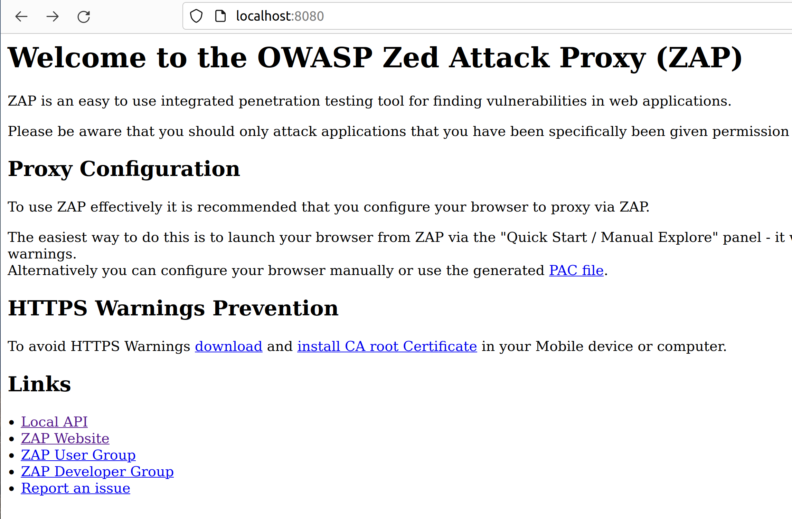
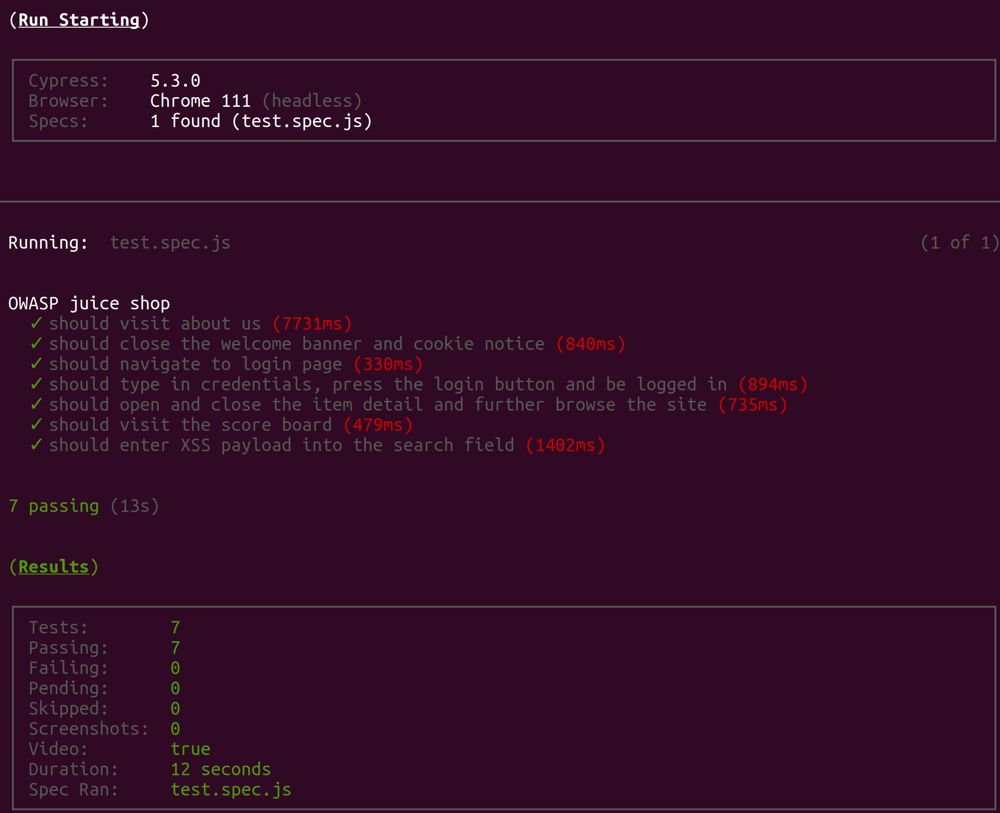
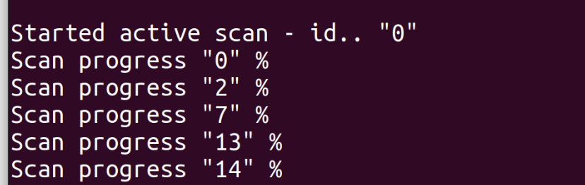
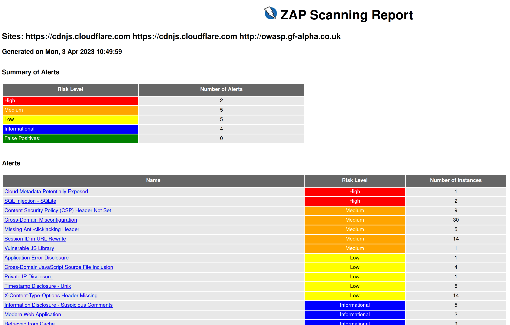

# DevSecOps: Automated Guided DAST with Cypress,  OWASP ZAP,  Burp Suite Pro

## td;lr

A PoC showing how to drive DAST scans with [Cypress](https://www.cypress.io) tests with the [OWASP ZAP](https://www.zaproxy.org/) againt the  [OWASP Juice Shop](https://owasp.org/www-project-juice-shop/). We also show how to use it with Burp Suite Pro.

For OWASP ZAP, To use the Docker version install Docker and the command line in the project directory 

```bash
export HTTP_PROXY=http://localhost:8080
export HTTPS_PROXY=http://localhost:8080
npm run  zap-docker:start
npm run cypress:tests
npm run zap:active-scan
npm run zap:scan-report
npm run zap-docker:shutdown
```


To use a locally installed OWASP ZAP, create a symlink to the zap.sh somewhere in the path and form  the command line in the project directory 

```bash
export HTTP_PROXY=http://localhost:8080
export HTTPS_PROXY=http://localhost:8080
npm run  zap-local:start
npm run cypress:tests
npm run zap:active-scan
npm run zap:z-report
npm run zap-local:shutdown
```

There are many other scombinations, all explained below

## Overview

DAST (Dynamic Application Security Test) tools use spidering/crawling to discover resources and then actively scan them for vulnerabilities. This approach is not really effective for SPAs  (single page applications) with heavy use of REST APIs that have no OpenAPI specification endpoints to crawl. The approach can also be problematic if you want to avoid large scale crawling and focus on the applications journey and business logic. 

This is where leveraging existing web automated test scripts can help for effective and guided DAST scan in the pipeline. 

This project is a proof of concept of leveraging web automated tests to automate DAST scans. 

In this PoC we  use [Cypress](https://www.cypress.io)  a very popular UI/E2E testing framework for web applications to guide [the OWASP ZAP](https://www.zaproxy.org/)  DAST tool.  The approach is applicable to any other web testing framework with  proxy configuration.

We use  [OWASP Juice Shop](https://owasp.org/www-project-juice-shop/),  an intentionally vulnerable web application as our example application.


The project has started from looking at two other previous efforts: https://github.com/jverhoelen/security-tests-with-owasp-zap-cypress and https://github.com/el-davo/cypress-zap

## Automated DAST with Cypress and Desktop tools

### OWASP ZAP

You can use  cypress to help  guide your desktop OWASP ZAP scans. [Here](docs/ZapDesktopWithCypress.md) is the guide on how to do it

### Bup Suite

Cypress can be used to drive Live Tasks with active scans ('audit') in Burp Suite Pro or passive crawling with Burp Suite Community.   [Here](/docs/BurpSuiteWithCypress.md) step by step walk through on  how to do this 


## CLI and CI-level Automated DAST with Cypress

### OWASP ZAP

You can use OWASP ZAP in headless mode, as a daemon). This can be done either using a local install of ZAP or the official docker image. The PoC provides  npm scripts for both.  Once the traffic is proxied we can start an active scan on the proxied traffic with the ZAP API, monitor its progress, retrieve the report , and optionally terminate the ZAP daemon.

#### Using OWASP ZAP installed locally 

1. **Setup the Proxy ports environment variables**

```bash
export HTTP_PROXY=http://localhost:8080
export HTTPS_PROXY=http://localhost:8080
```

2. **Start ZAP locally using**

```bash
npm run zap-local:start 
```

 This will start the zap daemon in foreground mode with its own output and blocking the terminal until you terminate  it.   

Alternatively you can use 

```bash
npm run zap-local:start-bg 
```

 which starts the zap daemon in the background

In both cases you can check whether the daemon is running successful but using https://localhost:8080 in the browser.



3. **Run Cypress tests to proxy all traffic through ZAP**

The PoC provides scripts to do in a couple of different ways:

run the tests and show the cypress UI. This is useful if you are running this on a desktop command prompt.

```bash
npm run cypress:tests-show
```

or run the tests but without showing the browser and cypress UI. This is the recommended way for CI integratons

```bash
npm run cypress:tests 
```

There are only a  few tests  which are enough to demonstrate the approach. Once the tests complete you will see a screen like this




4. **Initiate a ZAP Scan**

Once the tests are completed, you can initiate a scan with 

 

```
npm run zap:active-scan
```

This will start the scan and wait until it is completed, displaying the scan id and progress every 10 seconds.  




You can also use the browser to

- see  all running scans and their status in 
  - http://localhost:8080/JSON/ascan/view/scans/?

- terminate a scan
  - http://localhost:8080/JSON/ascan/action/stop/?scanId=<scan id> 

1. ##### **Retrieve the report**

   Once the scan is completed you can download the report with 

   ```bash
   npm run zap:scan-reports
   ```

    The main report is in HTML 

    

   ##### Shutdown ZAP Deamon

   To shutdown the running deamon use
   ```bash
    npm run zap-local:shutdown
    ```

   *Shutting down ZAP is optional. The scripts will get the correct scan id and you can have a long running ZAP daemon but the report is cumulative. If you want to have clean report, you should shutdown and start ZAP again for every run*.


Once the environment variables are set, you can run all scripts in one go with

```bash
npm run dast:all 
```

#### Using  Dockerised OWASP ZAP

The PoC also allows you to use the OWASP ZAP Docker container using the official stable image. 

You still need to set the environment variables

```bash
export HTTP_PROXY=http://localhost:8080
export HTTPS_PROXY=http://localhost:8080
```

 The workflow is like before but with different start and shut down scripts.  

```bash
npm run  zap-docker:start
npm run cypress:tests
npm run zap:a active-scan
npm run zap:scan-report
npm run zap-docker:shutdown 

```

 

You can also run all of the above in one step with

```bash
npm run dast-docker:all
```


### Burp Suite Pro

Burp Suite Pro has a REST API embedded that can be used to run scans 

However, the API will run a standard scan with a seed URL and will not benefit from proxying the URLs from Cypress

One approach would be to pass all the URLs as part of the scan definition but that will require to create a list of URLs from the Cypress run effectively writing an intermediate spider. 
